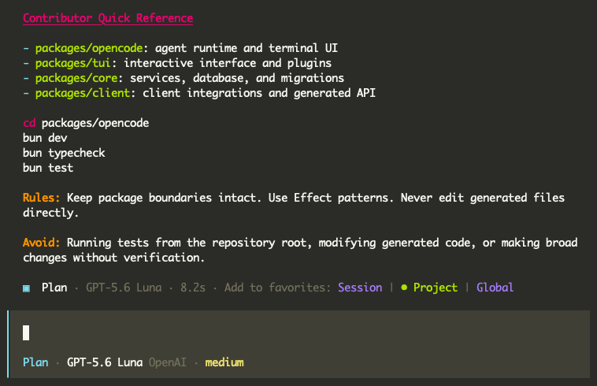
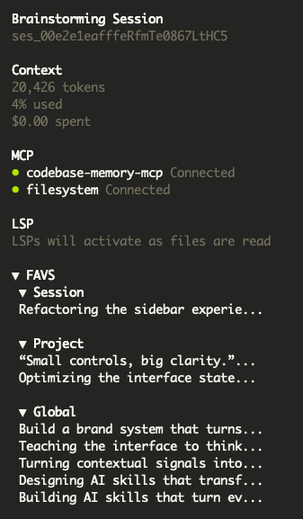

<div align="center">

# opencode-favorites

Scoped favorites for OpenCode AI messages.

[English](README.md) | [Português (Brasil)](README.pt-BR.md)

</div>

This project is designed for the custom [`opencode-foundry`](https://github.com/lucas-rulez/opencode-foundry) TUI extensions. A favorite keeps both the original message reference and a snapshot of the visible response content, so it remains available after history compression or message removal.

Each message has at most one favorite:

- `session`: visible only in the source session.
- `project`: visible in sessions with the same project ID.
- `global`: visible in every session.

Clicking the active scope removes the favorite. Clicking another scope moves the existing favorite directly to that scope.

The plugin persists favorites locally and provides scoped browsing in the TUI sidebar.

## Demo

The plugin adds the three scoped favorite actions directly to the assistant message metadata:



The active scope is shown with a green marker. Selecting another scope moves the favorite directly, while selecting the active scope removes it.

The sidebar with favorites populated across multiple scopes:



The sidebar includes a collapsible `FAVS` section with independent toggles for `Session`, `Project`, and `Global`. Empty scopes stay hidden, each snapshot is displayed as a single truncated line, and the sidebar updates immediately when favorites are added or removed. Favorite messages are currently displayed only; selecting a message will be defined in a later iteration.

## Compatibility

The TUI integration requires an OpenCode build with the `message_metadata` slot and the host-owned `Action` component. These capabilities are being developed in the [`opencode-foundry`](https://github.com/lucas-rulez/opencode-foundry) fork.

After building the package, configure the fork's `tui.json` with:

```json
{
  "plugin": [
    "opencode-favorites/tui"
  ]
}
```
